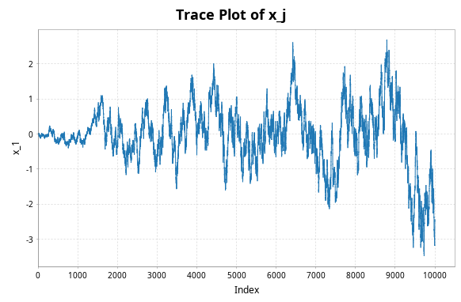

- [The toy problem](#orgbe169e3)

This is my attempt at implementing Adaptive Metropolis (or, as I prefer, Adaptive MRTH) in scala, using the breeze library.

This is based on the example from the article "Examples of Adaptive MCMC" by Boberts and Rosenthal.


<a id="orgbe169e3"></a>

# The toy problem

We target the distribution $\pi(\cdot)\sim \mathcal N(0,\Sigma)$, where $\Sigma = M \in \mathbb R^{d\times d}$ is a matrix with random $\mathcal N[0,1]$ entries. Let's refresh how to use matrices in Scala by generating this matrix;

```scala
//silent

import AdaptiveMetropolis._

// dimension of the state space
val d = 25

// create a chaotic variance to target
val data = Gaussian(0,1).sample(d*d).toArray.grouped(d).toArray
val M = DenseMatrix(data: _*)
val sigma = M.t * M
```

Note that Breeze's `DenseMatrix` and `DenseVector` are actually mutable in Scala, so we need to be careful not to mutate anything.

A AMRTH step is defined as follows;

-   If $j\leq 2d$, we do a MRTH step with proposal $q(x,\cdot)\sim \mathcal N(x,(0.1)^2I_d/d)$
-   If $j>2d$, we use the proposal $q(x,\cdot)\sim(1-\beta)\mathcal N(x,(2.38)^2\Sigma_j/d)+\beta\mathcal N(x,(0.1)^2I_d/d)$, where $\Sigma_j$ is the current empirical estimate of the covariance matrix so far.

We can compute the empirical covariance matrix at step $j$ by

$$\begin{aligned} \Sigma_j=\frac{\sum_{i=0}^{j} x_ix_i^{\intercal}}{j} - \frac{(\sum_{i=0}^{j} x_i)(\sum_{i=0}^{j} x_i)^{\intercal}}{j^2}. \end{aligned}$$

The logic I'm using is to carry forward $\sum x_ix_i^{\intercal}$ and $\sum x_i$ (as well as the current index, $j$) as part of our 'chain', in order to compute the empirical covariance matrix as we go along (I should possibly do a $\frac{n}{n-1}$ transormation to this matrix too), in order to sample from the proposal when $j>2d$ .

I also improved the efficiency by removing any unnecessary inversions and constructions of diagonal matrices.

The core of the algorithm is this. `one_AMRTH_step` takes the current state as well as the QR decomposition of the true variance to output the next state. `AMRTH` then iterates this in order to create an infinite lazy list of samples.

```scala
//noeval

case class AM_state(j: Double,
  x_sum: DenseVector[Double],
  xxt_sum: DenseMatrix[Double],
  x: DenseVector[Double])
def one_AMRTH_step(state: AM_state, q: DenseMatrix[Double], r: DenseMatrix[Double], prog: Boolean): AM_state = {

  val j = state.j
  val x_sum = state.x_sum
  val xxt_sum = state.xxt_sum
  val x = state._4

  // print progress every 1000 iterations if 'prog=true'
  if (j % 1000 == 0 && prog) {
    print("\n   Running: " + j + "th iteration\n")
    //print("   Completed " + j/10000 + "%\n")
    val runtime = Runtime.getRuntime()
    print(s"** Used Memory (MB): ${(runtime.totalMemory-runtime.freeMemory)/(1048576)}")
  }

  val d = x.length

  if (j <= 2*d) then { // procedure for n<=2d

    val proposed_move = x.map((xi:Double) => Gaussian(xi, 1/d.toDouble).sample())
    val alpha = 0.5 * ((x.t * (r \ (q.t * x))) - (proposed_move.t * (r \ (q.t * proposed_move))))
    val log_acceptance_prob = math.min(0.0, alpha)
    val u = Uniform(0,1).draw()

    if (math.log(u) < log_acceptance_prob) then {
      val nx_sum = x_sum + proposed_move
      val nxxt_sum = xxt_sum + (proposed_move * proposed_move.t)
      return(AM_state(j+1, nx_sum, nxxt_sum, proposed_move))
    } else {
      val nx_sum = x_sum + x
      val nxxt_sum = xxt_sum + (x * x.t)
      return(AM_state(j+1, nx_sum, nxxt_sum, x))
    }

  } else { // the actually adaptive part

    val sigma_j = (xxt_sum / j)
    - ((x_sum * x_sum.t) / (j*j))

    val u1 = Uniform(0,1).draw()

    val proposed_move = if (u1 < 0.95) then {
      MultivariateGaussian(x, sigma_j * (2.38*2.38/d.toDouble)).draw()
    } else {
      x.map((xi:Double) => Gaussian(xi, 0.01/d.toDouble).sample())
    }

    val alpha = 0.5 * ((x.t * (r \ (q.t * x))) - (proposed_move.t * (r \ (q.t * proposed_move))))

    val log_acceptance_prob = math.min(0.0, alpha)
    val u2 = Uniform(0,1).draw()

    if (math.log(u2) < log_acceptance_prob) then {
      val nx_sum = x_sum + proposed_move
      val nxxt_sum = xxt_sum + (proposed_move * proposed_move.t)
      return(AM_state(j+1, nx_sum, nxxt_sum, proposed_move))
    } else {
      val nx_sum = x_sum + x
      val nxxt_sum = xxt_sum + (x * x.t)
      return(AM_state(j+1, nx_sum, nxxt_sum, x))
    }
  }

}

def AMRTH(state0: AM_state, sigma: DenseMatrix[Double], prog: Boolean): LazyList[AM_state] = {

  val qr.QR(q,r) = qr(sigma)

  LazyList.iterate(state0)((state: AM_state) => one_AMRTH_step(state, q, r, prog))
}
```

and we can test the algorithm with

```scala
//silent

// initial state
val state0 = AM_state(0.0, DenseVector.zeros[Double](d), DenseMatrix.eye[Double](d), DenseVector.zeros[Double](d))

val n: Int = 100000 // size of the desired sample
val burnin: Int = 100000
val thinrate: Int = 10
// The actual number of iterations computed is n/thin + burnin

val amrth_sample = thin(AMRTH(state0, sigma, true).map(_.x).drop(burnin),thinrate).take(n).toArray

// Empirical Variance matrix of the sample
val sigma_j = cov(DenseMatrix(amrth_sample: _*))
```

```scala
print("\nThe true variance of x_1 value is\n" + sigma(1,1))

print("\n\nThe Empirical sigma value is\n" + sigma_j(1,1))
```

(I want to run this interactively with mdoc, but it doesn't like the first line of the first code block `import AdaptiveMetropolis._`)

Running this (as it is in the main() function of the object `AdaptiveMetropolis`), I get the empirical variance $\approx 12.72711$ against the true variance $\approx 12.85363$ (this is for $d=25$ dimensions).

I also plot the trace of the first element using the `plotter` function;

```scala
plotter(amrth_sample, 0, "./exports/adaptive_trace.png")
```



Roberts and Rosenthal also give the following measure of effectiveness;

$$\begin{aligned} b = d\frac{\sum \lambda_i^{-2}}{(\sum \lambda_i^{-1})^2 } \end{aligned}$$

where $\lambda_i$ are the eigenvalues of $\Sigma_p^{1/2}\Sigma^{-1/2}$ where $\Sigma_p$ is the empirical variance matrix at the pth iteration.

$b$ should approach 1 as the chain approaches the stationary distribution. Roughly, it measures the difference between the empirical and true variance matrices.

We compute this value as follows;

```scala
//silent

val eigsigmaj = eig(sigma_j).eigenvalues
val eigsigma  = eig(sigma).eigenvalues

val lambda = sqrt(eigsigmaj) *:* sqrt(eigsigma).map(x => 1/x)

val lambdaminus2sum = sum(lambda.map(x => 1/(x*x)))
val lambdainvsum = sum(lambda.map(x => 1/x))

// According to Roberts and Rosenthal, this should go to 1 at the stationary distribution
val b = d * (lambdaminus2sum / (lambdainvsum*lambdainvsum))
```

```scala
print("\n The b value is " + b)
```

I get a value of $b\approx 1.000014612$, so it seems to be working.
