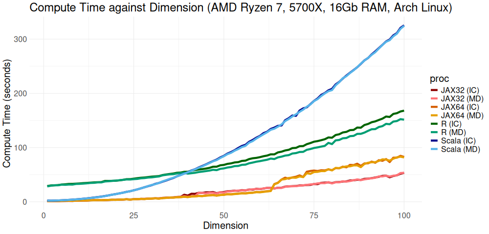

This is my attempt at implementing Adaptive Metropolis in Scala, using the breeze library, and python, using JAX.

This is based on the example from the article "Examples of Adaptive MCMC" by Roberts and Rosenthal.


# Adaptive Metropolis Algorithm

A AMRTH step is defined as follows;

-   If $j\leq 2d$, we do a MRTH step with proposal $q(x,\cdot)\sim \mathcal N(x,(0.1)^2I_d/d)$
-   If $j>2d$, we use the proposal $q(x,\cdot)\sim(1-\beta)\mathcal N(x,(2.38)^2\Sigma_j/d)+\beta\mathcal N(x,(0.1)^2I_d/d)$, where $\Sigma_j$ is the current empirical estimate of the covariance matrix so far.

We can compute the empirical covariance matrix at step $j$ by

$$\begin{aligned} \Sigma_j=\frac{{\sum_{i=0}^j} x_ix_i^{\intercal}}{j} - \frac{({\sum_{i=0}^j} x_i)({\sum_{i=0}^j} x_i)^{\intercal}}{j^2}. \end{aligned}$$

The logic I'm using is to carry forward $\sum x_ix_i^{\intercal}$ and $\sum x_i$ (as well as the current index, $j$) as part of our 'chain', in order to compute the empirical covariance matrix as we go along (I should possibly do a $\frac{n}{n-1}$ transormation to this matrix too), in order to sample from the proposal when $j>2d$ .


## Measure of effectiveness

Roberts and Rosenthal also give the following measure of effectiveness;

$$\begin{aligned} b = d\frac{\sum \lambda_i^{-2}}{(\sum \lambda_i^{-1})^2 } \end{aligned}$$

where $\lambda_i$ are the eigenvalues of $\Sigma_p^{1/2}\Sigma^{-1/2}$ where $\Sigma_p$ is the empirical variance matrix at the pth iteration.

$b$ should approach 1 as the chain approaches the stationary distribution. Roughly, it measures the difference between the empirical and true variance matrices.


# Example Target

We target the distribution $\pi(\cdot)\sim \mathcal N(0,\Sigma)$, where $\Sigma = M \in \mathbb R^{d\times d}$ is a matrix with random $\mathcal N[0,1]$ entries. In Scala, this can be found as below;

	```scala
import AdaptiveMetropolis._

// dimension of the state space
val d = 10

// create a chaotic variance to target
val data = Gaussian(0,1).sample(d*d).toArray.grouped(d).toArray
val M = DenseMatrix(data: _*)
val sigma = M.t * M
```

Note that Breeze's `DenseMatrix` and `DenseVector` are actually mutable in Scala, so we need to be careful not to mutate anything.


# Scala implementation

My Scala implementation of this is found in `Main.scala` (it needs cleanup though). It is built around an object `Adaptive Metropolis`, with three methods:

-   `AM_step`, which takes the current state as well as the QR decomposition of the true variance, and outputs the next state of the chain.
-   `AM_iterator`, which iterates `AM_step` in order to create an infinite lazy list of samples.
-   `plotter`, which plots the 1st componant of the sample, and saves it to a file.

The `run` function then tests this, using `d=10`, `n=100000`, `burnin=100000` and `thinrate=10`. This function, once it finishes, prints out the true variance of $x_1$, the empirical estimate of it from the sample, the $b$ value, and the time the computation took. A trace plot of $x_1$ is also saved to `Figures/adaptive_trace_scala.png`.


# JAX implementation

As you might imagine, the JAX implentation is very similar, even if it is a bit more fragmented. The `AM_step` function is split into four functions, `try_accept`, `init_step`, `adapt_step`, and `AM_step`. This is mainly due to the way JAX handles `if else` statements, making this seem like the convenient way to do it.

In the file `AM_in_JAX.org` (or `.md`), there is the source code as well as documentation for all the functions, but it is very similar to the scala version.


# Results

In both implementations, we run with `d=10`, `n=100000`, `burnin=100000` and `thinrate=10`.


## Scala

The Scala output can be found using the command `sbt run` in this project's root;

> The true variance of x<sub>1</sub> is 4.0203388245821
> 
> The Empirical sigma value is 4.041380732669074
> 
> The b value is 1.0000233300468546
> 
> The computation took 9.178699105 seconds

-   note: it seems to take longer now, about 12 seconds


(note that I can't get rid of the transparency in Breeze-viz, so you may have to turn off dark mode to see this properly)


## JAX

The JAX output can be found by running `python AM_in_JAX.py` in this project's root;

> The true variance of x<sub>1</sub> is 9.967914581298828
> 
> The empirical sigma value is 9.99879264831543
> 
> The b value is 1.0000910758972168
> 
> The computation took 3.7597200870513916 seconds

Obviously, the numbers are different since the target variance is different, but this ran over twice as fast


### update

For high dimensions, I had to increase the size of the data types to 64 bit; this drastically impacted computing time for JAX

> The true variance of x<sub>1</sub> is 6.589626408404064
> 
> The empirical sigma value is 6.551140424596137
> 
> The b value is 1.0000435338955926
> 
> The computation took 7.1804351806640625 seconds

now, the benefits over scala are more minor!


## Very high dimensions

The paper, in it's examples, get results for `d=100`. In Scala, using thinning and burn-in, the garbage collector does a good job and we can get high enough iteration counts the the program does very well.

For `d=100`, `n=10000`, `burnin=1000000`, and `thinrate=100`, I get

> The true variance of x<sub>1</sub> is 87.24837703682367
> 
> The empirical sigma value is 86.13431051648674
> 
> The b value is 1.0003412161513419
> 
> The computation took 14962.10357885 seconds


and in JAX we again get roughly twice the speed (oops that was with about 10 times fewer iterations)

> The true variance of x<sub>1</sub> is 109.05463889081547
> 
> The empirical sigma value is 111.75204879394798
> 
> The b value is 1.0036710382794376
> 
> The computation took 786.4629402160645 seconds


(this isn't currently the correct graph, I accidentally wrote over it, I will re-run soon)


# Benchmarks on a more powerful system

On my personal PC with a Ryzen 7 5800X and an RTX 3060ti (notably a gaming card, not particularly suitable for this purpose) I get the following results


## Scala

> The true variance of x<sub>1</sub> is 11.731161806946728 The empirical sigma value is 11.856237624615899 The b value is 1.00016514597069 The computation took 11.173750967 seconds


## JAX (CPU)

> The true variance of x<sub>1</sub> is 7.858357375214536 The empirical sigma value is 8.02485487422553 The b value is 1.0004841316639048 The computation took 1.9246833324432373 seconds


## JAX (GPU)

One of the biggest reasons to use JAX is its NVIDIA GPU support. Running the same $d=10$ test again,

> The true variance of x<sub>1</sub> is 7.858357375214536 The empirical sigma value is 8.02485487422554 The b value is 1.0004841316639033 The computation took 30.754671812057495 seconds

so something is very wrong!


# Complexity vs time

In order to get a better idea of how these implementations compare, we use the same chaotic variance matrix for both, with increasing submatrices, so we can make a graph of problem dimension, `d`, against time.

Firstly, here is a little python code to write out the matrix to a csv file, so both programs can read it, so we control the target variance;

```python
import jax
import jax.numpy as jnp
import jax.random as rand
import csv
import numpy as np

# keys for PRNG
key = rand.PRNGKey(seed=1)

d = 100

# create a chaotic variance matrix to target
M = rand.normal(key, shape = (d,d))
sigma = M.T @ M

with open('data/chaotic_variance.csv', 'w', newline='') as csvfile:
    writer = csv.writer(csvfile)
    writer.writerows(np.array(sigma))

'data/chaotic_variance.csv'
```


## Plotting

From here, both versions have a function `compute_time_graph` which outputs a csv file containing the time it took to compute over a million iterations for each submatrix of the intputted variance matrix, whcih will be provided from this file. This is then plotted as below using R.

```R
library(ascii)
library(ggplot2)
library(dplyr)
library(tidyr)
library(patchwork)
```

```R
jax_times_laptop_1 <- cbind(1:100,read.csv("./data/JAX_compute_times_laptop_1.csv", header = FALSE)) %>%
  mutate(proc = "JAX1")
names(jax_times_laptop_1) <- c("d","n", "thinrate", "burnin", "time", "b", "proc")
print(ascii(head(jax_times_laptop_1,3)), type="org")
```

```R
scala_times_laptop_1 <- cbind(1:100,read.csv("./data/scala_compute_times_laptop_1.csv", header = FALSE)) %>%
  mutate(proc = "Scala1")
names(scala_times_laptop_1) <- c("d","n", "thinrate", "burnin", "time", "b", "proc")
print(ascii(head(scala_times_laptop_1,3)), type="org")
```

We can now use `ggplot` to make a nice plot of this data.

Putting the data together and plotting

```R
data <- rbind(jax_times_laptop_1, scala_times_laptop_1)
print(ascii(head(data)), type = "org")

time_graph <- ggplot(data, aes(x = d, y = time, color = proc)) +
  geom_line(size = 2) +
  scale_color_manual(values = c("JAX1" = "red", "Scala1" = "blue")) +
  theme_minimal() + 
  labs(title = "Compute Time against Dimension",
       x = "Dimension",
       y = "Compute Time (seconds)") +
  theme(text = element_text(size = 20))
print(time_graph)
```



We can also plot the effectiveness value, $b$;

```R
b_graph <- ggplot(data, aes(x = d, y = b, color = proc)) +
  geom_line(size = 2) +
  scale_color_manual(values = c("JAX1" = "red", "Scala1" = "blue")) +
  theme_minimal() + 
  labs(title = "Effectiveness against Dimension",
       x = "Dimension",
       y = "b") +
  theme(text = element_text(size = 20))
print(b_graph)
```


We can see that while both perform equally as well, JAX maintains roughly double the performance of Scala across the board.


## On the PC

I also ran the complexity on the PC. These are the results

```R
jax_times_pc <- cbind(1:100,read.csv("./data/JAX_compute_times_pc.csv", header = FALSE)) %>%
  mutate(proc = "JAX")
names(jax_times_pc) <- c("d","n", "thinrate", "burnin", "time", "b", "proc")
scala_times_pc <- cbind(1:100,read.csv("./data/scala_compute_times_pc.csv", header = FALSE)) %>%
  mutate(proc = "Scala")
names(scala_times_pc) <- c("d","n", "thinrate", "burnin", "time", "b", "proc")
```

```R
data <- rbind(jax_times_pc, scala_times_pc)
print(ascii(head(data)), type = "org")

time_graph_pc <- ggplot(data, aes(x = d, y = time, color = proc)) +
  geom_line(size = 2) +
  scale_color_manual(values = c("JAX" = "red", "Scala" = "blue")) +
  theme_minimal() + 
  labs(title = "Compute Time against Dimension",
       x = "Dimension",
       y = "Compute Time (seconds)") +
  theme(text = element_text(size = 20))
print(time_graph_pc)
```


This graph is much more easily explainable; Scala is smooth and very clearly quadratic (which makes sense), and JAX is mostly quadratic but with a bump around $d\approx60$, which is likely due to maxing out some cache size. From there the line gets a bit wobbly, and I'm not sure how to explain that.


## Repeats

Given the odd shape of the original graph, I re-ran them three more times recently. A few things were different this time;

-   I have recently re-installed my OS, meaning drivers, background processes etc. may be different
-   Python is now running in a virtual environment
-   the `eig` functions in the JAX `effectiveness` function are changed to `eigh` to take advantage of symmetry and to allow compatibility with a GPU

None of these should, hypothetically, affect anything. Nevertheless, this is the graph I get;

```R
jax_times_laptop_2 <- cbind(1:100,read.csv("./data/JAX_compute_times_laptop_2.csv", header = FALSE)) %>%
  mutate(proc = "JAX2")
names(jax_times_laptop_2) <- c("d","n", "thinrate", "burnin", "time", "b", "proc")
jax_times_laptop_3 <- cbind(1:100,read.csv("./data/JAX_compute_times_laptop_3.csv", header = FALSE)) %>%
  mutate(proc = "JAX3")
names(jax_times_laptop_3) <- c("d","n", "thinrate", "burnin", "time", "b", "proc")
jax_times_laptop_4 <- cbind(1:100,read.csv("./data/JAX_compute_times_laptop_4.csv", header = FALSE)) %>%
  mutate(proc = "JAX4")
names(jax_times_laptop_4) <- c("d","n", "thinrate", "burnin", "time", "b", "proc")
scala_times_laptop_2 <- cbind(1:100,read.csv("./data/scala_compute_times_laptop_2.csv", header = FALSE)) %>%
  mutate(proc = "Scala2")
names(scala_times_laptop_2) <- c("d","n", "thinrate", "burnin", "time", "b", "proc")
scala_times_laptop_3 <- cbind(1:100,read.csv("./data/scala_compute_times_laptop_3.csv", header = FALSE)) %>%
  mutate(proc = "Scala3")
names(scala_times_laptop_3) <- c("d","n", "thinrate", "burnin", "time", "b", "proc")
scala_times_laptop_4 <- cbind(1:100,read.csv("./data/scala_compute_times_laptop_4.csv", header = FALSE)) %>%
  mutate(proc = "Scala4")
names(scala_times_laptop_4) <- c("d","n", "thinrate", "burnin", "time", "b", "proc")
```

```R
data <- rbind(jax_times_laptop_2, jax_times_laptop_3, jax_times_laptop_4,
              scala_times_laptop_2, scala_times_laptop_3, scala_times_laptop_4)

time_graph_laptop_2 <- ggplot(data, aes(x = d, y = time, color = proc)) +
  geom_line(size = 2) +
  scale_color_manual(values = c("JAX1" = "coral", "JAX2" = "coral2",
                                "JAX3" = "coral4", "JAX4" = "coral1",
                                "Scala1" = "cadetblue", "Scala2" = "cadetblue2",
                                "Scala3" = "cadetblue3", "Scala4" = "cadetblue4")) +
  theme_minimal() + 
  labs(title = "Compute Time against Dimension",
       x = "Dimension",
       y = "Compute Time (seconds)") +
  theme(text = element_text(size = 20))
print(time_graph_laptop_2)
```


The JAX performance is significantly worse after the cache is filled, and consistently so! I have no idea what is causing this, it is the same code that was ran on the PC.
